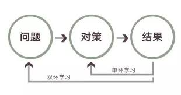

# 你那么努力，为啥却看不到进步？

## 1 为什么勤奋无法换来成功？

勤奋的销售员，披星戴月地推销产品，从早到晚，每天的工作时间超过12小时，但是为什么最后效果不佳，距离个人致富的目标还是那么远？

亲切的售后客服，耐心地劝导愤怒的顾客，不管顾客多么冲动、多么失礼，都始终保持专业的微笑和礼貌的态度，但为什么最后还是有么多顾客觉得，恰恰是客服人员在一定程度上刺激了自己的情绪？

尽职尽责的经理人自认为对所有员工关心备至，努力维持和所有人的良好关系，为什么还是有那么多员工提出了离职？

这些熟悉的场景，每一天都在我们身边发生。那些看起来努力生活和工作的人，为什么无法用勤奋换回他们梦想中的结果？

**其实原因非常简单，这些人的共同特点就是他们并不懂如何学习。**

不管他们是曾经如何风雨兼程、呕心沥血，甚至曾经作为学霸叱咤风云，但在实际生活中，他们将越来越频繁的有那种“用一头年老疲惫的老牛，拉着一辆满载的货车去登山”的感觉，费力而绝望。

## 2 你是一个“双环学习者”吗？

你竟然说学霸不懂学习，怎么会？实际上，关于如何学习，当代管理理论的大师克里斯·阿吉里斯曾提出一个“双环学习”的概念。

“双环学习”对应的是“单环学习”，克里斯·阿吉里斯认为：**大部分人之所以在工作和学习上事倍功半，很大程度上都是因为他们只会“单环学习”**，即只着眼于解决眼前的问题，而不懂得反思和抓住本质。

阿吉里斯做过一个有趣的比喻：

如果一个人通过阅读、聊天，或者其他什么渠道，知道了“调温器在温度低于68度时自动供热”这个知识点，就是一个单环学习的过程；而如果他能够提出疑问“为什么是68度”，并尝试寻求其它更经济的温度设置，这就是在进行“双环学习”。

[]

“双环学习”的书面定义是：从对问题本质的反思开始，以开放的质疑与讨论作为过程，最后通过克服“习惯性防卫”造成的认知障碍，从战略层面对现有问题进行反思，从而取得根本性改善。

特别绕口，不像人话？别担心，其实没那么复杂。**“双环学习”的核心就在于找到问题的核心根源，尽可能把遇到的问题放在一个更广阔和更长远的背景下去思考，然后尝试用“实验室”精神对自己提出的问题做出解答。**

## 3 “单元学习”千万要不得

别看这么简单，却还是有大把的人终其一生都领悟不到“双环学习”的奥秘。接下来，我们尝试用两个例子来说明“双环学习”和“单环学习”的不同。

关于“单环学习”的极端例子，莫过于网上曾经流传过一个关于清华工科男的段子。它描述了一个不懂女生心理的男生是怎么丧失一次又一次机会的。

其中一个情节是，男生好不容易把自己心仪已久的隔壁班女生约出来，深秋，夜晚，小树林边，女生搓着手说：“好冷啊。”男生琢磨了一会儿说：“那我去买个煎饼给你暖暖手吧。”

然后，当然就没有然后了。

故事里男生解决了表面的手冷的问题，却没能理解女生真正期待的“暖”的含义，这就是**典型的“单环学习”：只着眼于当下最明显的问题，而忽视了背后深刻的暗含意味。**

很多人把这种行为简单称为“情商低”，实际上，这就是一种陷入了“单环学习”模式的表现。

另一个例子来自工科男扎堆的华为公司。

2006年，华为在苏丹代表处投标一个移动通信网络项目。公司与客户联系时，各部门各自为政，调研的、出解决方案的、最后负责产品交付的……每一个部门都挺努力，也挺上心，跟苏丹方面沟通时，也是尽最大努力显示华为一方的诚意。

但是因为各部门对苏丹一方的承诺不同，而且部门之间也没有进行及时沟通，导致苏丹一方一直以来都并不满意。

在一次客户召集的网络分析会上，华为共去了八个人，每个人都诚恳而竭尽全力地向客户解释各自领域的问题，但是客户的CTO当场抱怨：“我们要的不是一张数通网，不是一张核心网，更不是一张交钥匙工程的网，我们要的是一张可运营的电信网！”

最终，这个投入了大量人力、物力和财力的投标还是失败了。

这两个例子中，第一个例子里的男生在思考问题时，如果能够把问题放在一个更长远的背景下去理解，也就不难听出女生的“话外之音”了。**钱钟书在《围城》里说，当一个女生向一个男生接一本书的时候，只有傻子才会以为她只是接一本书。**从这个意义上说，理解了“双环学习”才能追到女神啊。

而第二个例子中，华为不可能不知道自己的合作方需要的是一个整体解决方案，只不过实际操作中，当一个组织中的每一个人都有相对明确的目标后，反而容易落入到“单环学习”的陷阱中。

在这次痛苦的失败后，经过三年磨砺，华为苏丹团队提出了“铁三角”管理模式，并且成为了任正非《让一线呼唤炮火》这篇文章的主要素材来源。

## 4 避免“习惯性防卫”和“熟练的无能”

这时候就需要提到双环学习中需要克服的两个障碍：“习惯性防卫”和“熟练的无能”。

**习惯性防卫：**

具体的表现就是在与人沟通时，我们常常陷入到“争执”的阶段，而忘记了沟通的目的。谈崩了的合作、翻脸的夫妻、反目的朋友，很多都是不小心被“习惯性防卫”这个小东西所害。

一旦我们站在自己的立场上，以让对方接受自己的观点为目标，基本上就意味着沟通要马上失效。**有效率的沟通都是双方寻求彼此一致的需求，以看起来更为对方着想，其实也符合自身利益的方式来进行的。**

有个段子说，如果你觉得跟一个人聊天特别轻松愉快，那么很有可能对方比你的段位高出了好几个level。是不是高出好几个level不一定，但是可以肯定的是，那个让你觉得聊天格外愉快的人，一定是一些方面领悟了“双环学习”的人。

**熟练的无能：**

在阿吉里斯看来，越是聪明人，越有可能在某一方面成为能力高超的专家，但正因如此，他们的这种障碍也会表现得越明显。

这段话其实很容易理解。比如苹果电脑没有散热孔这个事情，如果让一个精通笔记本电脑零部件的人来做，是无论如何也不可能实现的。因为在他看来，一个机器要散热是多么正常的事情，要散热当然就要有散热孔。

**所以，很多创新总是从边缘行业和边缘任务身上出现，而很少真的在内部爆发。**

## 5 转换思路，勤奋才能不白费

好了，现在回到开头那些熟悉的场景里，我们来一起看看文章开头那些人面临的问题吧。

那个不怕苦、不怕累的销售员，如果能够在卖命工作之余，思考一下如何能够让自己推销的产品打动人，从需求方的角度考虑为什么需要这个产品的话，可能他的销售之路会更加有效率。

那个亲切的售后客服，也许该放弃训练有素的职业微笑和标准式的礼貌回复，而真正沉下心听听顾客的要求，尝试站到对方的角度去解决问题，可能会更迅速和轻松地解决客户投诉。

## 罗胖曰

所谓“单环学习”，就是答题。

所谓“双环学习”，就至少还要想以下几件事——

1. 我为什么一定要做这道题？
2. 出题人为什么要这样出题？
3. 这道题有没有改进的空间？
4. 怎样答题最符合我自己当前的利益？
5. 答完这道题，有利于我答下一道题吗？