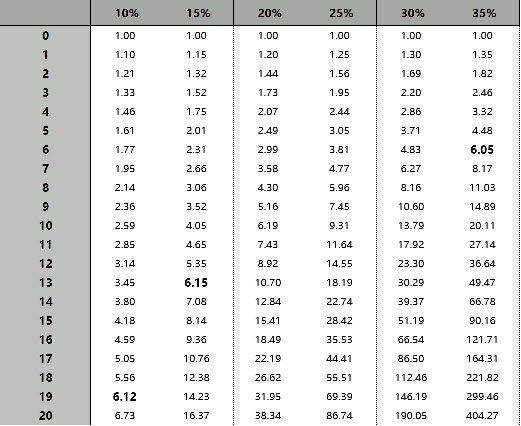
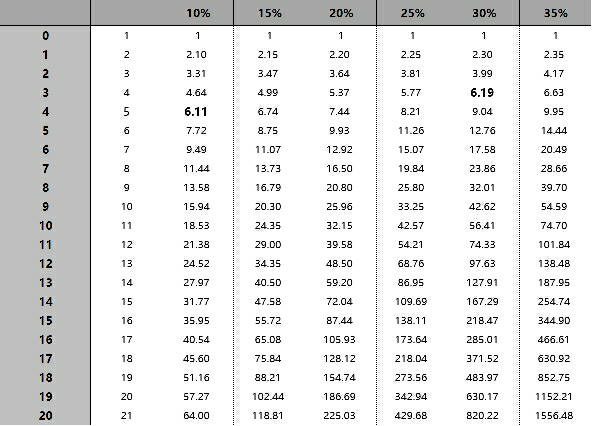
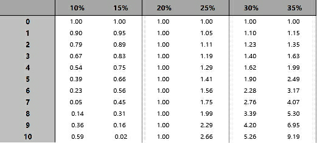

# 长期究竟是多长？

下面的表格，最好你也在Excel(Windows)、Numbers(Mac)、或者，Google Spreadsheet上做一个，以便自己反复把玩……

最上面一行，罗列的是不同的年化复合收益率，最左边一列，罗列的是投资年限。如果你的复合年化收益率做到30%，那么在第一年结束的时候，你的本金加收益已经等于1.30……到了第十年结束的时候，本金加上收益应该总计为13.79，也就是说，翻了接近14倍。

> 注意：别去算绝对值……也就是说，别想着我要是最初投资了xxx钱，那么现在应该是xxxx钱……只看倍数就好了。

> 在以上表格中，B3单元格里的公式是：=B2*(1+B1)

在这个表格里的数字，能够很直观地告诉我们一个事实：

> “长期”很可能对不同的人来说长度是很不一样的。

在表格里找找数字对应吧。对于能做到年化复合收益率35%的人来说（先忍住，不要去想“我能不能做到？”），6年后的效果（6.05），相当于能做到年化复合收益率10%的人要等上19年才能达到的效果（6.12）.即便是年化复合收益率比10%仅仅高出5个百分点，即15%，也可以“提前6年”达到差不多同样的效果（6.15）……

一个比较直接的结论是：

> 你越弱，你的长期越长……

再翻译一遍：

> 你竟然可以通过提高能力缩短长期的长度！

什么？！我知道这个说法常常会让人忍不住从椅子上跳起来（我亲眼见过很多很多次）——“为什么我从来没有认真想过这事儿呢？”是这样的，这世上只有很少的人愿意通过自己的“深入”思考提高自己的选择或者行动的质量。“深入”之所以打上了引号，就是想提醒读者，那所谓的“深入”真的很深入吗？那所谓的“深入”真的很难吗？那所谓的“深入”真的是“一般人根本做不到的”吗？显然不是。显然其实很简单，其实很容易做到，甚至，其实人人都可以做到！

事实上，弄不好你“跳早了”，因为实际上，我还有更狠的翻译：

> 学习使人长寿。

因为刚刚的结论，实际上是相当于在说，对越有能力的人来说，“长期”的时限越短，于是，他们在“长期”过去之后，相对于别人有着更长的“自由”时限……何止长寿啊！这分明是：

> 学习使人拥有更高质量的长寿……

还没有完，这才刚刚开始。

如果，如果我们竟然把“定投策略”加进来，那么我们看到的是另一个表格。第一行，显然还是年化复合收益率；最左边的那一列还是年限，而左边第二列，是累计投资金额——假设每年追加一个单位的投资金额……

> 在以上表格中，C3单元格的公式是：=C2*(1+C1)+1

首先，10%的年化复合收益率，与30%的年化复合收益率，在第三、四年的时候看起来都没有太大的差异……

这是个特别明显也特别经典的例子，可以用来说明：

> 在一定程度上，策略可以弥补能力上的不足。

这就是为什么明智的投资者比起相信“自己的智商与能力”来说更相信“策略的力量”的核心原因。

正确决策的力量是非常大的。对比两张表格，同样是10%的年化收益率，在第一张表格里，要等到第19年才能做到6.12，在第二张表格里，第4年就能做到6.11……

我知道你在想什么：

> 在第二张表格里，我总计投入是5个单位啊！

关键点在于，那多出来的4个单位（5-1=4）分明是你贯彻执行策略的结果啊！

到了这里，有一个关于投资的“秘密”终于“浮出水面”，你“不得不”也得看到了：

> 投资的重要秘密之一在于：你最好有除了投资以外的稳定的收入来源……

若你是那种“总是不得不把投资收益中的一部分拿出来花掉的人”的话，那你就惨了。我们看看第三章表格：

> 以下表格中，假定投资者每年必须花费0.2个单位的资金

> 在以上表格中，B3单元格里的公式是：=B2*(1+B1)-0.2

这张表格都没有什么必要拉到20年的长度，因为即便是年化复合收益率高达35%，翻倍都至少需要4年过去，坚持10年，也不过是9.19……更何况能做到35%的人，事实上是万分之一啊，难上加难！

总结一下：

1. 对能力越强的人来说，“长期”越短……
2. 对能使用正确策略的人来说，“长期”更短……
3. 对有能力在投资之外赚钱的人来说，“长期”更短……

回过头来，我们其实有个可以计算长期的公式，这个公式叫做“72法则”：

**x≌72/年化复合收益率值**

比如，你的年化复合收益率是10%的话，那么你需要72/10，大约7年时间让你的投资翻倍；如果你的年化复合收益率是25%的话，那么你需要72/25，即大约3年的时间让你的投资翻倍。

在此基础上，你可以这么理解：

> 能让你的投资翻倍的时间，相当于中期；

> 能让你的投资翻倍再翻倍的时间，相当于长期；

于是，最终，一切都是可以倒着算出来的……你现在可以理解为什么巴菲特认为至少需要十年以上才算是长期了，因为他给自己定的目标和事后长期的要求是：

> 买到复合年化增长率至少是15%的股票……

在这个目标下，5年翻倍，10年翻倍再翻倍——当然，他事实上的表现比自己当初设想更好，于是，他做到的是：

> 运用自己的能力（和能力的提升），把5年缩短为3年多一点，把10年缩短成6年多一点……

所以，当我们讨论长期的时候，事实上对每个人来说，虽然使用的是同一个词汇，但实际上，那“长期”对每个人来说都是不一样长的……而你的“长期”究竟是多长呢？你需要自己算一算，自己“掂量掂量”——毕竟，多了一点点的依据，不是吗？

最后，再多叮嘱一句：

> 你越年轻，就越觉得“长期”越长……

除了我在《把时间当做朋友》里提到的那个道理

> 对一个五岁的孩子来讲，未来的一年相当于他已经度过人生的20%；

> 而对一个五十岁的人来讲，未来的一年只相当于他已经度过的一生的1/50，即2%。所以，从感觉上来看，随着年龄的增加，时间好像越来越快。

而在投资这个领域里，时间对于几乎所有人还有另外一个感觉：

> 你越年轻，欲望越多也越强烈……

年轻的时候有太多（事后可能会觉得不必要的）花钱的欲望和需求，这使得那“长期”感觉更长！还好，“投资所需要的特定思考能力”是可以逐步习得的，并且也是可以逐步增强的——乃至于人生重新充满了希望。

# 思考与行动

1. 大多数人在岁数还小的时候，是很难“认真”思考未来的，总觉得那是“不可控制”的事情，总觉得那是“不可预期”的事情，可最终，都是“一转眼”就“长大了”，甚至“变老了”……请认真回顾你曾经以为“遥遥无期”却“突然之间就来临”了的事情，一定有，每个人都有……记下来，只要想到就罗列到一块儿——这对你强化“未来很快或者突然就会降临”的感觉有极大的帮助。
2. 在电脑上用Excel(Windows)、Numbers(Mac)、或者Google Spreadsheet，自己动手制作以上三个表格，经常看，试着在脑子里推演——要做到像九九表一样了解这几张表格。
3. 在过去的几周里，你可能时常有这样的念头，“啊？原来这是可以算出来的啊！”——是的，数学很重要（但总是被轻视），并且，很多的时候，数学也不是很难（但总令一些人畏惧）。你要在本子里翻开新的一页写上一个标题“可以算出来吗？”以后，不断地在这里罗列你搜集来的“原来是可以算出来”的例子，以及，你好奇“是不是可以算出来”的东西，以便提醒你不断思考，不断寻求答案。相信我，“迷恋做数学应用题”，是很好的习惯。

