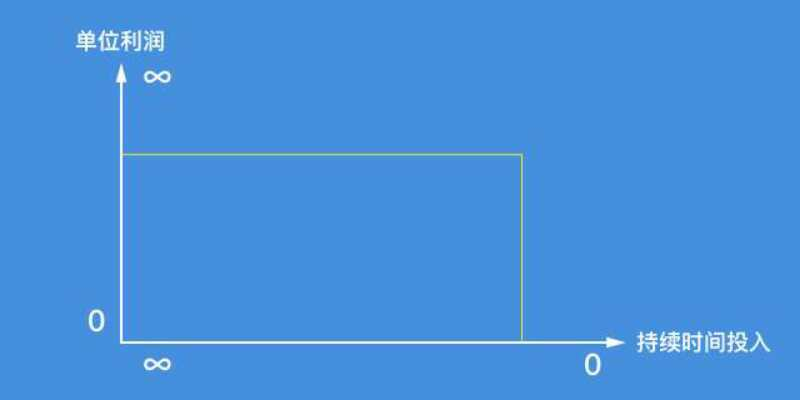

# 为什么你一定要学会写作？

除了他们说的许多必须学会写作的理由之外，除了“内容创业”突然火了而引发的理由之外，甚至除了培根说的“读书使人完整，讨论使人完备，写作使人完善”之外……

其实，有无数的理由去支撑这个结论：

> 想要获得财富自由的你，必须学会写作。

然而，我还有个你不是不能，但绝对不应该拒绝的理由：

> 写作是“把自己的同一段时间重复销售很多次”的极少数选择之一，也是相对来看最容易成为普通人起步的台阶之一。

互联网变革了信息流动方式、速度、渗透度与广度，进而实实在在地改变了人们的社交形式——过去，仅仅十多年前，有个说法还是可以站住脚的：绝大多数人一生能够交往的人数大约150人，可转眼到了移动互联网时代之后，我想150这个数字已经不够用了，可能要乘上10也不一定够用……

在这样的时代里，有效沟通，显然是最重要的技能，甚至应该归到“最重要的生存技能”中去，一个人的沟通效率，从底层决定了一个人最终可能获得的资源及其质量，至于高质量的资源最终会爆发成什么，在哪里爆发，那是后面的事儿……但，我们就是应该清楚地认识到有效沟通的重要性。

演讲与写作，都是比私下交流更为高效更具价值的有效沟通方式——说话谁都会，写字谁都会，但，同时对很多人说话，同时面对很多人发表文字，其实并不是谁都会的事情——比例很可能比较低，远远低于1%，否则的话，中国至少应该有五百万成年人善于演讲与写作，观察一下身边，貌似并没有那么多人的演讲与写作大受欢迎吧？

从单位时间销售的角度望过去，“你给一群人讲道理”与“你给一个人讲道理”，虽然不是没有区别，但从时间精力上来看，事实上的区别没有多大，不过，效率却有了极大地提升。而“演讲”或者“讲课”常常还要收到地理位置的局限，互联网的出现与普及，在使得写作可以“即时发布”的同时，又彻底打破了地理位置的局限……

当年我选择去新东方，理由其实很清楚，在那里有更大的课堂。当时一个班的人数普遍是四五百人，甚至有过一千两百人的会场……同一段时间出售了那么多次，拿到的报酬一定更高，很明显，不是吗？

再后来，我一定要想办法写出出版，也是基于同样的理由。你花九个月的零散时间，打磨出一本可以长销十几年的书，不就是相当于把那九个月的零散时间拼起来卖了几百万次吗？对个体来说，还有什么比这个效率更高呢？我出版的第一本书的稿费，到现在也就那样一直躺在银行里（我故意把那张银行卡减掉了），一分钱没有动过——至少有一大笔“你根本用不上的钱”，不就是“财富自由”的核心标志之一吗？

几乎是十年前，我在一个饭桌上跟一些人讲过几乎同样的话，大意是，“今天的这个时代里，普通人是可以通过写书获得财富自由的”……记得当时有个声音颇有些“质疑”，说，“这事儿一般普通人做不到吧？”当时我也没做什么回应。虽然都有十来年过去了，我还是可以很清楚地回想起来当时我脑子里的声音，“做到之后就不是普通人了……再说，所谓‘普通人’并不是因为起步时普通，而是因为他们‘永远普通地活着’才成了所谓的‘普通人’……”

我知道你也很可能脑子里就闪过同样的念头……我不会不回应你们的。

你所感受到的沮丧并非来自于“你是个普通人”，而是……请仔细阅读：

> 尽管你有着不同凡响的愿望，却时时刻刻像那些终究碌碌无为的人一样思考。

过去的许多年里，我经常听到这样的评价：

> 哎呀，你就是跟我们普通人想的不一样……

为了避免误解，我常常是一笑而过。可事实上，这“现象”其实有唯一正确解读的：

> 首先，不是因为最终不是普通人了才想得不一样；

> 其次，恰恰是反过来，正因为从一开始就想得不一样，才后来变成不普通的……

> 最后，更为重要的是，在起点上，绝大多数人都只能是普通人。

想法上的不同，最终落实成现实的不同，是需要时间才能“酿”出来的，并且，常常需要比大多数人想象得更长的时间——因为最终的差异，不仅是“翻倍”或者“翻倍再翻倍”，常常是“天壤之别”。

从某种意义上看，我们每个人所存在的世界，都基于我们各自对这个世界的理解，于是，对我们每个人来说，自己真正所处的世界，其实是相当主观的。所谓的“想法”，其实可以理解为“思考的方法”，很多人之所以不行，实际原因只不过是因为不仅没有“思考的方法”，甚至连思考都没有。

有个犀利的观察总结，说：

> 5%的人在思考：

> 10%的人认为自己在思考；

> 85%的人，宁愿死也不肯思考……

与普遍认为的不一样，这话并不是爱迪生说的，而是出自另外一个我们完全不认识的人……还有一句也不是爱迪生说的——虽然人们总是把这句话“栽赃”到他头上，但同样很有道理：

> 没有执行的想法只不过是幻觉。

于是，到最后，即便是那少数的5%中的绝大多数，有的也只不过是幻觉而已。

你有远大理想，那么你要跟“现在已经成功的人”比的，不是你的现在和他的现在，是“你的远大理想实现后的你”（即，你的将来）和他的现在……这不一下子就想开了吗？

现在的你，怎么可能还没怎么样呢，一开口就有雷鸣掌声，一动笔就有滚滚财源？你现在当然跟我们所有普通人一样，开口说话无人听，动手写字无人喝彩。正所谓人微言轻。可那有怎么样呢？谁不是从一文不名开始的？谁没有个“不堪回首”的过去？又有谁从一开始就站在山巅上？（可能你没想过，从一开始就站在山巅上，也不是很爽的事情，因为不下去看看也可能会终生遗憾……）

当然，你可能反应过来了，你已经反复阅读过的、想过的“活在未来”，真的不应该仅仅是一句激动一下就忘了的口号，而是每时每刻都要反复提醒自己的观念，你最终所有的“不普通”，都来自于这里——你刚刚就体会到了，我们所有人都一样的：“一不小心就活在当下了”，“一不小心就忘记了那个应该‘活在未来’的你应该怎么想事儿、怎么做事儿了……”

写书，很可能是这世界上极少数极少数“普通人”真正可以做到“一劳永逸”的事情。如果有能力写好，有能力出版，那么，这件事儿的收益模型就变成这样的了：

这个“坐标”看起来有点别扭，因为横向的坐标，貌似反过来了，起点上是无穷大，终点上才是零。可事实偏偏就是如此的，在这件事儿上，长期来看，持续时间投入越趋近于零，收益（面积）就越大。我的两本畅销书且长销的书都是这样的，《TOFEL核心词汇21天突破》卖了两辈子（14年），《把时间当做朋友》刚刚进入第二辈子（8年）……而我在出版后持续投入的时间成本是多少呢？趋近于零。

话说回来，通往财富自由的路，肯定不是只有“写书出版”这么一个的，是吧？而且，很多成功的人，也不一定擅长写作（或者擅长演讲）……但，即便还有别的路，你还是一定要学会写作，为什么呢？

因为如果你能写出大受欢迎的内容，一定是你“思考能力、分析能力出众”的结果。不要误以为“非虚构类”写作才需要这些能力，即便是编故事写剧本，也一样必须有这些能力。想要在任何一个领域成功，思考能力、分析能力，都是不可或缺的能力——这是铁板钉钉的事实。

我建议身边的朋友持续写作的原因，还有另外一个更为简单更为基础的理由：

> 持续写作很可能是锻炼学习能力、锻炼思考能力、锻炼分析能力、锻炼沟通能力的最直接、最低成本的方式。

你再观察一下就知道了。很多人写东西，只不过是“搬运工”而已，他们其实并没有深入学习，也没有深入思考，更谈不上深入分析，但，即便如此，也依然有相当的销路……从这个角度望过去，若是你有学习能力，你有思考能力，你有分析能力，可你竟然不会写作（换句话讲，也就是缺乏足够的沟通能力），那你岂不是亏死了？因为你最终还不如那些“实际上不如你的人”……

也许你又想问了，“那我如何开始呢？”还是那句话，这个问题没必要问，直接开始就是了……不过，我倒是有个“想法”需要你认真思考：

> 我写的这个东西对别人有没有用呢？

“写对别人有用的东西”，这是写作的终极技巧，没有什么比这个更重要的了。仅仅这么一个问题，就会把这世间绝大多数文字过滤掉，你说它重要不重要？至于文笔什么的，不是不重要，但重要程度若是跟这个原则相比较的话，甚至可以直接忽略。

顺着这个思路走下去，对自己的提问就会逐步细化、深入：

1. 我写的这个东西对别人有没有用呢？
2. 我写的这个东西对别人有用的话，有多大的用处呢？如何做到最有用？
3. 我写的这个东西对别人有用的话，对多少人有用呢？如何做到对更多人有用？
4. 我写的这个东西对别人有用的话，在多长的时间段里对别人有用呢？我如何才能让那个时间段更长一些呢？
5. 我写的这个东西对别人有用的话，如何才能优雅地让人们恰当地回馈我呢？
6. ……

这篇文章，有很多很多“以身作则”的地方——事实上，我在写任何文章的时候，都要花很长时间琢磨，“我写的东西真的对别人有用吗？”这一关过不去的话，甚至会让我感到没脸见人的地步……

写吧。**只要真写，就只能真思考。** 今天的你，无论多差都不重要，重要的是未来的你不差……未来的你为什么不差呢？因为曾经的你，不怕自己不差，不管多差也要硬着头皮实践，久而久之，你就撞见了未来的那个一点都不差的你。在这样的场景下，有句话非常应景：“但行好事，莫问前程……”

# 思考与行动

1. 在阅读的时候，你有分析作者思路的习惯吗？作者是如何一步一步思考到结论的呢？
2. 在阅读的时候，你有认真对比自己与作者的思路差异的习惯吗？找到差异之后，你应该做些什么？
3. 如果写作的根源是思考，那么，为了提高思考质量，你必须要做的事情都有哪些？
4. 写书，是一种难得的“可以把自己的时间长期重复销售很多次”的时间销售方式；那么，除了写作之外，还有什么活动也是如此的呢？
5. 显然，在另外一些情况下，持续时间投入又是必须的……在什么情况下如此？又，为什么？

不妨把今天的“思考与行动”写成一篇小文章，发布在“财富自由战斗组”或者“留言区”，从今天开始把每天写作当成一种习惯。我们在学习小组也发起了小活动，来看看吧？

