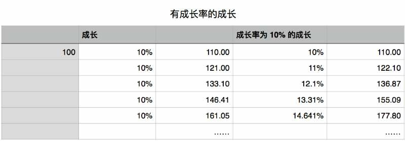

# 关于创业的选择

事实上，关于“万众创业”的争议，本质上不过是个“词汇之争”。我们早就知道，我们每个人的大脑就好像一个操作系统，而所谓的“思考的操作系统”，是由一个一个概念构成的。

我从来不认为“聪明”这东西是天生的，我更倾向于所谓的聪明，是习得的，是积累的，是可以不断成长的，甚至肯能是完全没有上限的。这样的理解，来自于我对“聪明”这个概念的定义：

> 看一个是否聪明，可以从两个层面入手：
> * 看他脑子里有多少清晰、准确、必要的概念。
> * 看他脑子里那些清晰、准确、必要的概念之间，有多少清晰、准确、必要的关联……

在学习当前这个专栏的过程中，大家想必早就发现了，我们不断反复提炼、矫正、修正、添加、删除自己的概念，可很少有什么重要的概念，是我愿意直接套用词典释义的——词典（甚至包括百科）只是“入门工具”，它们只能给出最基本（事实上在关键的时候还总是不一定正确）的解释，至于对于我个人来说，那概念意味着什么，我只能靠我自己不断探求，——所谓”路漫漫其修远兮，吾将上下而求索“，在我眼里，说的也不过是如此朴素的行动。

于是，我们一起全方位定义了很多概念（用俗话说，就是”吃透了那些概念“）：”财富自由“、”注意力“、”安全感“、”资本“、”抱怨“、”年化复合回报率“、”刚需“、”避险“、”活在未来“、”长期“、”给自己打工“、”需求“……事实上，每一期的文章，就是在打磨一个概念而已，然而，这个”而已“经年累月（注意，甚至偶尔会是”瞬间“），最终一定会给经历了升级的人带来巨大的变化，我经历过，我清楚。

差别其实很大：在有的人的脑子里，一个概念是一篇完整、清晰、例证丰富的文章，甚至是一本厚厚的书，在另外一些人脑子里，那个概念模糊不清，或者不存在，抑或干脆是另外一本烂书。

现在让我们来看看”万众创业“中的组成部分：”创业“，之于”万众“，一会儿再说——什么是创业？满足哪些条件才叫“创业”？那些在创业的人，知不知道自己做的事情是否算得上是创业？

我们先研究一个更为朴素的词汇吧：生意。生么是生意，好像谁都懂，至于生意的分类，也貌似很简单：好生意和差生意。那，有没有坏生意呢？——你可能已经想到了：坏的不叫生意。

也不是不能进一步细分，生意大抵上有以下几个层次：

1. 满足温饱的生意；
2. 能够赚钱的生意（温饱之外还有富余）；
3. 能够成长的生意（富余越来越多）；
4. 能够做到**成长率**不断提高的生意（这里包含着一个很多人从来都没想过的概念：成长率）……

你看，在这里，从第一条开始，绝大多数人就已经有分歧了。大多数人在考虑生意的时候，所谓好生意，只能想到这个层面：”能赚钱的就是好生意“。事实上，赚不到钱的，不叫生意，而赚得不足够多的，都是差生意……难道生活没有成本吗？生存没有成本吗？果腹纳税，都是成本，而且还是很高的成本——哪怕做过一点点生意的人都能深刻地理解这个”道理“。

理论上，做”以温饱为目标的生意“，真的谈不上是在”创业“，因为那种”以满足温饱为目标的生意“，总体上就是脆弱的，甚至可以说是”脆弱无比的“，它们从一开始就只能与各种事实上无法战胜的敌人作对：

* 微观上看
  * 不动产的成本（比如房租）在不断上涨；
  * 人力成本在不断涨；
  * 竞争者数量越来越多……

* 宏观上看
  * 每一次社会的经济结构变化对它们来说必然是一场浩劫……

所以，很快人们就会发现，绝大多数能够满足温饱的生意，最终被证明为”不会长期赚钱“。长期，很难做到。另外，若是”长期只能满足温饱“，那又有多大意义呢？

于是，从这个角度望过去，我们得修订一下”创业“的概念了：

> 不能不断成长的生意，谈不上是”创业“。

所以，真正的创业者，拼命思索的，不是”怎样赚钱“，而是”怎样成长？“如果才能做到今天赚100块，明天赚110块，后天赚121块（这只是”简单粗暴地举例“，数字只是”为了示例方便“）？如果没有成长，那就退回去了，变成”温饱生意“了，因为有一个每个人都看不到，但每个人都受影响的东西在空中飘荡——通货膨胀（虽然有些”冷静“的经济学家会告诉你，他们认为通货膨胀其实是个”伪概念“）……

接下来我们还要做一件事儿，意见我们已经做了很多次的事情：

> 在我们的思考上添加一个维度：长期……

真正厉害的创业者，考虑的不仅仅是”怎样成长“，而是”不断成长“，即，长期成长——你想想就明白了，能够成长，事实上已经是很难的事情了，你看看这世界最终展示的结果就明白了，貌似每个生意都有机会成长，可最终绝大多数生意并没有成长（跟人一样吧？）……长期成长，岂不是”难上加难“？

甚至不用在深究下去，只不过是看到这里，估计你就已经有结论了：

> 创业这事儿如果是这么定义的话，这就很难是”万众“的事儿了……

所以，当我们鼓励万众创业的时候，事实上是在鼓励万众自寻出路，自力更生——事实上，这种选择也真的没有什么负面作用，无论成功还是失败，有心的人们总是在不断吸取经验教训，多多少少有些进步，不是吗？从这个角度望过去，身处逆境的人更应该”创业“（这里，”创业“的意思，取”做满足温饱的生意“），难道应该鼓励他们”满足不了温饱就当减肥了吗？！“

然而，那些已经摆脱了温饱束缚的人，为什么要选择去做”以满足温饱为目标的生意“呢？事实上，还真的有很多人这么选择了——因为他们追求”安全感“，于是，把成长放到了（起码）第二位，或者干脆忘了更重要的东西：应该（只）仔细考虑成长。

让我们再看看，什么是”成长率不断提高的生意“。今天赚100块，明白赚110块，后天赚121块……这是在成长，但是**没有成长率**，每天的成长都是恒定的10%。成长率10%是什么样的呢？今天赚100块，明天赚110块，后天赚122块，大后天赚137块……成长率10%其实是个”很吓人“的数字——如果你已经习惯于”复利“思考的话，就不用算也猜得出来那有多吓人。

> 你可以参照这个表，感受下”有成长率的成长“会是多么的惊人。

于是，你可以反过来判断了：

> 那些天天琢磨如何保持”成长率“的创业者才是真正的佼佼者。

注意，都不一定是”提高成长率“——保持成长率已经是难上加难再乘以难了吧？到这里，就有个很严肃，甚至可以认为是”很深刻“的结论了：

> 没有”成长率“的创业公司，不值得风险投资进入……

再翻译一遍：

> 在风险投资者眼里，”成长率“最重要。

我个人是很敬畏”关键知识点“的。很多的时候，那些”关键知识点“明晃晃地放在那里，貌似谁都可以看到，可最终，大多数人就是能够做到”视而不见“——我不是说你，我实在说我自己！我自己当初也对这个”关键知识点“视而不见……直到我亏了很多钱（至于亏了多少钱，我不好意思告诉你或你们）之后，复盘的时候才发现，那些钱就是对关键知识点（”成长率“）缺乏敬畏的代价。

之前我提到过，每次复盘的时候，复盘自己的决策过程，最终的结论总是一样的：

> 当初在选择的时候，要么是①干脆忽略了某个必要的条件；要么是②在摸个必要的条件上没有做到足够苛刻……就这么两个原因，完全没有其他任何理由。

如果，我在投资决策过程中，对”成长率“这个最必要且最重要的指标上不足够苛刻，那么后面的结果只能是”自己选的自己受着“了。即便是走了狗屎运获利了，也只不过是”拿着火把穿过了火药厂“而不自知的傻子。

”关键知识点“的奇妙之处也在这里，它太宝贵了，乃至于”无价“——”无价“的另外一个直白的意思就是”没有价格“，或者更直白一些，”没办法有价格“。你想想看就知道了，我亏了那么多钱才深刻理解的道理，我想卖给你，你会出多少钱？你能出多少钱？首先，你出多少钱可能都没用，因为前提是我愿意讲给你听；其次，更为重要的是，我想要多少钱也没用，因为那”关键知识点“通常只不过是”公开的秘密“，谁都知道，或者说，”谁都感觉自己早就知道“……之前我告诉你GAFAFA的秘密，你真的愿意为此给我多少钱？——事实上，无论是多少，我都能理解，因为你知道、我也知道那结果的意义。于是，我当然从一开始就没想过为一个”无价“的事情具体收费多少。

然而，以上的文字，如果你自己思考过，反刍过，最终可能会产生一个非常严肃的结果：

> 当你研究一个创业点子的时候，能调用你的元认知能力，把自己的注意力放到”成长率“验证之上，哪怕只不过是用上一个小时去思考，最终你的结论，也很可能与国际上顶级投行的专业质量已经相差无几了……

——这绝对是事实，这也的的确确是”关键知识点“的力量。在”关键知识点“面前，立竿见影的效果真真切切地存在。硅谷的投资大神彼得·蒂尔在他的《从0到1》里提到，餐厅也好，电影也罢，都是”烂生意“（Shitty Business）——很多人不理解，纷纷表示”那就把烂生意都教给我吧！“事实上，从彼得·蒂尔的角度望过去，他所描述的都是事实。基于他的标准的事实，那么那些生意就很难有成长率——虽然可能会长期，虽然可能有成长，但是，就是不适合他那种投资人，他那种资本。

简单明了。

然而，即便是餐厅这种在彼得·蒂尔眼里的烂生意，也不见得大家都能做。市场早就证明给我们看了，这世界的餐馆（全世界都实在差不多），1/3赚钱，1/3赔钱，1/3维持……也就是说，别说成长率了、别说成长了，就是只做一个”维持温饱“的生意，也依然有三分之一的从业者”不合格“。

好了，这星期你可要天天想了：

> 你自己曾经考虑过的”生意“，究竟属于哪一个类别？为什么？有没有更好的选择？
> 之前你可能没有思考根据，现在有了——你会发现，这个看似不起眼的问题，那可是相当地烧脑呢！

# 思考与行动

1. 还记得我们以前的文章吗？”什么是落后？“从今天这个角度望过去，”1%之后全是落后“有了个清楚的解释——大多数人连成长都没有，何谈成长率？你身边谁是”有成长率的人“？你见过、分析过哪个”有成长率“的公司、项目或者团队？
2. 你曾经遇到过什么”无价的关键知识点“？你用什么方式回馈了教会给你的那个人？
3. 你身边的聪明人都有谁？你觉得自己值得他们重视吗？如果是，为什么？如果不是，为什么？接下来你应该怎么办？

# 回答问题

1. 身边没有这样的人。我的脑子里没有过“成长率”这个概念，自然也从未从这个角度去看别的公司、项目或团队。即便是现在知道了，也想不到从哪里开始分析，很想看看别的同学是怎么思考的。我应该把这个概念放到选择有价值的公司的标准上，其实上周谈到的关于”选择“的方法论，是可以直接用来做美股投资选择的，我真是蠢，竟然没有意识到它们之间如此明显的关联，而这周的”成长率“是可以被加入选择的必要条件。

2. 最近几个月连续出现了三个，第一次是在张海霞的讲座里，第二次是在成甲的讲座和书里，第三次是本周的”关键知识点“。

  * 张海霞的描述很具体，表面上只针对学生考试，就是找个笔记本，针对自己弄不明白的题目，写出自己的思考过程，步骤一、步骤二、步骤三……——也就是从自己的文字写出”我是怎么思考这个题目的“，在绝对不要看答案的前提上，确认自己针对这个问题已经没办法再思考下去——”卡住了“，”找不到其它方法了“，我们结束这次思考过程（这是一次把自己的思维推到极致的过程）。间隔一段时间（几分钟、几小时或一天甚至几天都可以），拿出之前写出步骤和思考过程，再一次尝试往更深的地方思考，把自己的思维深度推向下一次极限（一般来说，你会比上次有进步），再次确认自己”卡住了“才停止思考。间隔一段时间，再次重复这个过程。如此多次重复，直到我们确信自己的答案正确。然后找正确答案来比对，如果我们的答案错了，我们一定要从正确的解题流程和答案中总结出题者的思考流程，如果我们的答案错了，我们也要拿自己的解题流程和正确答案的解题流程来仔细比对，寻找自己的思维上的不足，力争让自己对这道题，这类题做到全方位的了解，彻底掌握这道题，这样才能做到”少做题，拿高分“。这样的学生不会出现”成绩不稳定“，因为他们对自己足够了解，对题目足够了解，知道哪些题目会做，哪些不会做。现实生活中，考试中的绝大部分题目都是我们平常见过的，如果我们能做到对做过的题目都了如指掌，那我们的分数怎么可能不高呢？
  * 听了成甲的讲座我也觉得收获很大，他认为最快学习某领域知识的方法通过对该领域的顶尖高手的思考过程来学习这些知识的底层规律来迅速提高自己，这和张海霞的”思考自己的思考过程“的做法相似——学习好的同学，有相似的学习方法。成甲的书，我才开始读，书中提出了”临界知识“——知识的底层规律，这本书我读得很慢，思考时间远超读书时间。
  * ”关键知识点“和”临界知识“是相同概念的不同表述吧，我觉得但从字面上看，更容易理解。
  除了听他们的讲座，买他们的书，我没有更好方式回馈几位老师。

3. 我的生活圈很窄。但我想的是：为啥要问这第三个问题呢？和成长率有啥关系呢？