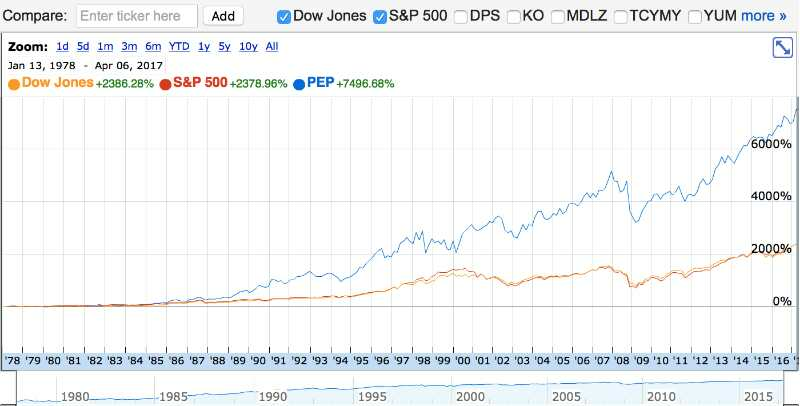
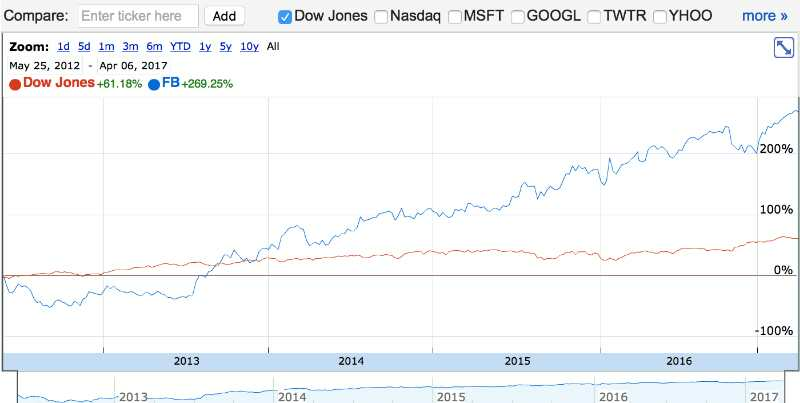

# 提高成长率的方法

概念与关联，是操作系统的基本核心，随之产生的是价值观与方法论。价值观决定你的选择，而方法论告诉你应该怎么做。听起来很简单，可它最终难道什么地步呢？难道即便老师讲过，即便学生读过，可没过多久，要么是干脆彻底忘了，要么是根本没想到应该“在这里用上”……

“成长率”确实是个令人焦虑的概念，因为一旦拿这个概念衡量“创业”项目，马上99.99%的创业“想法”就直接不合格了。即便合格，最终也不一定成功——即，最终也不一定能够真的实现那个设想中的成长率。这也是为什么一些顶级投资人最初看上的项目，在一开始看起来是个金块，可最终却变成了屎坨的原因。

在你不知道“成长率”这个概念之前，你的世界是一个样子，在你知道“成长率”之后，你的世界是另外一个样子……是这个世界改变了吗？没有啊！它还是那样。是你的操作系统变了（比之前多了一个清晰、必要、准确的概念），于是，你“看”到的世界不一样了。

有一个精彩的类比：

> 教育就像一副眼镜。在带上眼镜之前和带上眼镜之后，你所身处的世界是一样的，但是带上眼镜之后，你看到的是一个更为清晰的世界……

从这个意义上来看，我写这个专栏的过程，对我来说是极其享受的，因为我打心底确定给自己正在干一件伟大的事情，在一个十几万人构成的群体当中从事真正的教育——很难想象我一个人正在和堂·吉诃德一样，与一个已经转动了千百年的“风车”（即，原本就应该优质，我们也希望它优质的所谓教育体系）较劲。

关于“我就好像那个堂·吉诃德”这话，十多年前，我在新东方写作课堂上说过，因为当时我的感受也是一模一样的：台下坐着来自各个地区不同年级的中国学生，每次几百人，都一样——这么多年过去，竟然不知道写作课是没必要讲遣词造句和修辞的，写作课应该更多的是思考课而不仅仅是语法课……十多年的所谓教育把他们变成了那个样子，我现在要凭一己之力，在几节课之间把他们变成另外一个样子——你说我像不像堂·吉诃德？

有些人认为李笑来是“鸡汤大师”。我不争。首先，正所谓“将军赶路不打小鬼”，但更为重要的是，我其实非常清楚一个重点：

> 那些鸡汤厌恶者，实际上对所谓的“鸡汤”并没有一个清晰准确的定义。事实上，“鸡汤”这个词，根本不配成为一个概念，于是，根本不在我的操作系统之内，根本不值得讨论，又如何配得上争论呢？

那些鸡汤厌恶者，不仅不知道自己概念混乱——事实上，这就叫脑子乱，因为操作系统的核心是乱套的——更不知道自己犯下的逻辑错误究竟是什么。他们整天说“这个没用”、“那个没用”……却完全无法回应一个头脑正常的人随便就能问出来的简单问题：“那你说说有用的究竟是什么？”他们当然哑口无言，因为他们根本就没想过这个问题才具有真正的价值。唉，他们根本不懂（即，脑子里没有）这么个概念：

> 建设性意见

关于“建设性意见”这个概念，我后面还有专门的文章，不着急。

回过头来，让我们继续在概念上构建价值观，在所谓“生意”这件事儿上：

> 成长率 > 成长 > 赚钱 > 谋生……

然后，我们可以在此基础上，“自然而然”地构建我们方法论……于是，我们就想到了通往财富自由之路的路径，起码有两个：

1. 自己做出一个有长期成长（或长期成长率）的公司
2. 用自己的钱投资那些已经证明自己有长期成长（或者长期成长率）的公司……

而第二条路径又分两个层次：

1. 在那些有长期成长（或者长期成长率）的公司股票尚未公开流通之时投资（比如天使投资、风险投资、PE等等就在做这样的事情），此为所谓的“一级市场”；
2. 在那些有长期成长（或者长期成长率）的公司股票公开流通之后投资，此为所谓的“二级市场”。对普通人来说，这可能是更好的选择。

于是，如果你自做得到最好……当然，这事儿确实非常非常难，于是，也许你更有可能做不到，但“自己做不到”并不是绝境，因为你和所有人一样，起码还有另外一个谁都挡不住的路可选择：在二级市场用自己的钱投资。

现在应该给一些读者另外一个“意想不到的沉重打击”了：

> **我早就讲过！** 从第二十三周的文章开始，有好几周的文章都在讨论第二条路径里的第二个层次，不仅有概念，还有具体的方法论……甚至，我还干脆送了你一个组合：**GAFATA**！（详见1月2日的文章）还要怎样嘛！

让那些以为我的文章，竟然是他们都不知道是什么的“鸡汤”的人们，继续那么想好了……

> 让一些人继续自己为是地错误地活下去是对他们最恰当的惩罚。

在清晰、准确、必要的概念之间搭建清晰、准确、必要的关联，很重要，却不是像看起来的那样容易的事情。

回头接着说正事儿。在股票市场（即，所谓的二级市场）里投资的有利条件，并不比风险投资差多少——因为能够成为上市公司本身，就相当于“跨过了一个很高的门槛”。在公开的股票市场里，都是财务必须依法公开的、已经被证明为起码在足够长期的时间里不断成长的公司。

> 补充说明（一）：我个人很少在国内的股市投资（虽然也有一点点）。在我眼里，国内的股市总体上来看，还有太多不成熟甚至很幼稚的地方，理性决策的价值常常会不由自主地收到不明力量的扭曲，理解起来太累。我猜，它们还需要很长时间才能进入相对理想的状态吧？

> 补充说明（二）：天使投资人和VC，有时候统称为“风险投资”（Venture Capital）——Venture Capital里面的"Venture"，通常被直译为“风险”；而事实上，Venture这个词作为名词，有两个释义，1. 企业 2. 探索（牛津英汉大词典）。于是，“风险投资”常常被人们望文生义地以为那些投资人就是“甘愿冒风险的人”——事实上，我们之前也提到过，所有成功投资人最终都是“长期成功避险者”（详见12月19日的内容）。

投资很难有早晚之说，可能只有“正确与否”。你说，若是你在十年前开始在二级市场上买入百事公司（Pepsi Co. Inc）的股份，算不算晚呢？那可是一个于1898年8月28日成立的品牌——你没看错，这家公司都快一百二十岁了……正确的决定是不怕晚的。

再看看Facebook上市后的情况：

所以，如若最终一个人沦为“平庸”，真的不能怪这个世界，这个世界若是有什么路的话，一定是谁都可以走的，这世界若是有什么门的话，通常并不上锁……从这个角度望过去，我真心认为这世界其实非常美好，虽然开始觉得有些不美好，但是都是自己选的，怪不得别人。

那如果你是个学生，如果你是个初入职场的人，现在还没有足够的“资本”（请回顾9月5日·第6周的文章）去投资，那怎么办？在你的个人成长上，如何做到真正有成长率？并且保持成长率？甚至逐步抬高成长率？

请允许我再给你“沉重的打击”（相信我，打打更健康！）：

我们早就讲过！

放下手机，给你十分钟回想一下，再回来……其实，我们早就讲过的，把第8周到第10周的文章重新看一遍！

**多维竞争力。** 还记得吗？

在一个维度上跟人比较，显然会让你各种焦虑，但多一个维度就彻底不一样了呀！就在上一周的加餐文章（4月3日）里，我还示范了一次“多维竞争力”的应用呢，你没读到？你没想到？

于是，方法论就明确得一塌糊涂：

1. 学习学习再学习（请回顾第9周的文章）
2. 学习更多技能（给自己添加更多维度，请回顾第8周的文章）
3. 长期持续（请回顾第12周的文章）

万事俱备，只欠思考与行动。

# 思考与行动

> 是时候回头重新阅读了。概念与概念之间可以有很多关联，你读过那么多，“学”过那么多，却有多少真正连起来了呢？
