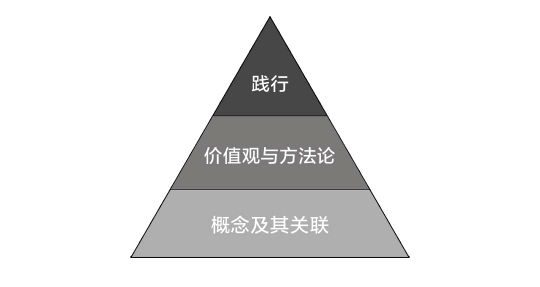

# 如何提高自己的智商

不管你信不信，反正事实如此：

> 大部分所谓的智商的确不是天定的，而是后天习得的。

我们每获得一个新的知识点的时候，智商就具备了上升的条件，当我们把某个知识点应用到自己的生活与行动之中之后，智商就开始事实上拉升——可若是不应用，不行动，生活无改变，而那智商不会发生变化。

事实上，你天天都看得到，有些人在行动，有些人无所事事，于是，有些人的“智商”天天在攀升，另外一些人的智商永远保持在初始的水平——当然，相对来看，必然是在不断“跌落”，因为水虽然涨了，船却沉了。

事实上，我们早就定义过聪明（其实也就是所谓“智商”的表现）：

> 脑子里有多少个清晰、准确、必要的概念；

> 那些清晰、准确、必要的概念之间有多少清晰、必要、准确的关联……

再进一步，我们把概念及其关联当做自己“操作系统”的基础设施，用来不断吸取新的概念与关联，必要的时候更新甚至替换旧的概念与关联；与此同时，启用元认知能力不断审视整个操作系统的有效性……事实上，这就是所谓的“智商”的运行机制——挺简单，也挺清楚。

在此之前，我们已经从若干个角度为大家分析过“长期”这个概念（你可以查看2月20日的文章回顾）。事实上，在这个专栏里的整个内容中，“长期”是最重要的概念之一，很多人就是因为自己的“操作系统”里根本就没有“长期”这个概念，所以才终生吃亏且不自知。可又多少人即便是自己的“操作系统”里有“长期”这个概念，却也没有建立清晰准确且必要的关联？上一期的文章中，大家也看到了，很多人只不过是因为小时候没有把“长期”与“有用”这两个概念以清晰准确且必要的方式联系起来，于是“抱憾终生”。

我们还举过例子，很多人不小心把“碎片化”这个概念和“学习”联系起来，就耽误了自己；事实上，与“碎片化”这个概念可能产生关联的，并不是“学习”，而更可能是“时间”——碎片化的，只不过是时间，而不应该是学习。

再举一个例子，我和很多人一样鄙视甚至痛恨所谓的“速成”。不过，让我们拆解一下：所谓“速成”，其实就是“快速”的“成功”……可问题在于，这的确是事实：“快速”这个概念，根本就不应该与“成功”产生关联；可另外一个事实也是客观的：“快速”与“入门”是可以关联起来的，并且，“入门”这事儿不仅要快，还要特别快，否则起步永远在门外徘徊？（……一口气三个例子奉上，够你震惊一下的了吧？都是你原本应该想到，却长期忽视的关联呢！）

操作系统跑起来，底层是概念与连接，上层运转的主要是什么呢？两样东西：

* 价值观
* 方法论

我们的概念定义都很简单直白：所谓的“价值观”，就是不断分辨“什么更好？什么最好？”所谓的“方法论”就是不断思考“如何做？如何改进？”

你可能早已经想到了：

> 价值观决定选择的质量（选择是人生头等大事）
> 方法论决定选择后行动的质量（行动构成人生）

这个专栏的读者，绝大多数已经体会到“智商提高”的整个过程。从开始了解“注意力”这个概念的定义，到价值观的形成：注意力 > 时间 > 金钱，到选择上的更新，再到后继的行动，比如，“不那么在意所谓的热点新闻了”，再到“开始有意识地把注意力放到更重要的事情上去”……而后，生活必然发生变化，因为选择发生了变化，行动发生了变化。

再比如，通过学习，我们知道了，“长期”总是更有价值的考虑因素。于是，概念上我们深入理解了长期之后，就自然而然地把“长期”这个概念与很多其他的概念关联起来，比如，“判断知识是否有用的时候加上一个维度：长期”；再比如，“赚钱”这事儿也一样要加上“长期盈利”才更有价值……进而，我们更新了关于长期的价值观：长期的更好；这还没完，我们还有各种相关的方法论开始“自然而然”地衍生出来：既然如此，我们应该活在未来，既然如此，我们要想办法知道长期究竟有多长？哦，原来可以通过专注、行动与努力，把自己的“长期”变得比别人的“长期”更短一些……厉害了！

今天我们想要研究所谓的“智商”。智商是什么？有很多定义的方法，其中有一个特别简单实用的定义：

> 所谓的智商，其实就是“解决问题的能力”。（不一定是“马上解决问题的能力”，“经过长期努力”，也是很强的能力，实际上就是智商高的表现……）

于是，我更容易接受这个论断：“大部分所谓的智商的确不是天定的，而是后天习得的。”（这里有妥协：就算有一部分是天定的，也只是少部分……）于是我们的价值观更可能成为这个样子：

> 认为学习与行动比天分更重要（学习与行动是大部分的成因，而天分是少部分的成因……）

于是我们的方法论也会因此发生变化，我们更容易接受之前提到过的事实：

> 刚开始肯定做得不够好，做得多了，做得久了，就会慢慢好起来——至少是到足够好的地步……

于是我们的选择变了，我们的行动变了，于是我们的生活变了：我们开始变得不那么在意他人的看法，尤其是那些不学习、不行动的人的看法——他们的看法不可能是对的嘛！

说了这么多，其实相当于过往内容的一个提炼或者总结。那有没有什么“快捷方式”可以用来提高智商呢？有！我们是有方法论的人嘛——起码，即便是在没有方法论的时候，也要一直琢磨方法究竟在哪里？

很简单：调整关注焦点。

把你的注意力放到不同的地方，就会产生不一样的效果。以下是一张著名的图片。你把注意力往上挪一点，你看到的是一个少女，你把注意力往下挪一点，你看到的是个老太太……还有个有趣的现象：刚开始你只能看到一个形象，多看一阵子，你竟然就可以同时看到两个形象……我们的大脑很神奇。

很多的时候，在一些小事上，只因为关注点不同，可能直接造成最终的巨大差异。这样的例子很多，讲出来最令人震惊的可能是这个：

> 人们在选书的时候关注的焦点非常不同。

乍一想，选书、买书、读书，这是多简单的事儿啊！事实并非如此。很多人的关注焦点常查给你在封面设计上，在书名上，还有的人关注焦点在腰封上，看“哪些牛人推荐了这本书”……甚至有些人的关注焦点在书的价格与页数的比例上，估计你听过这样的评论：“这么薄的书，咋卖这么贵？！”——他们买的不是知识，而是纸张而已。

两分钟讲清楚，让你把关注焦点放到更有价值的信息上去：

* 看版次
* 看印次
* 看出版社
* 看参考文献

……这些东西，常常在书的最后几页。多次再版、多次重印、每次印数更多的书籍，相对质量更有保障（虽然不是绝对）；而在选择非虚构类书籍的时候，作者认真罗列的参考文献列表，能让你看出他对一手资料的尊重与研究程度，没有任何（或者有很少很少）参考文献列表的书籍，基本上都是抄袭和搬运……

书，可是要读进脑袋里的东西啊！怎么可能稀里糊涂就选了，稀里糊涂就读了，稀里糊涂就信了呢？可惜，真的有很多人，活了好几辈子（比如35岁就是5辈子了），竟然一直没有调整优化过自己的关注焦点，于是……那个惨状你自己想想吧，我就不花笔墨描述下去了。

其实，“调整关注焦点”，某种意义上只不过是我们不断说的“打造价值观”的一个时间方法论：

* 有的时候我们可以尝试着用不同的价值观去研究某一事物（或者任务）；
* 调用元认知能力去分析不同价值观带来的不同选择，以及那选择的后果；
* 经过比较，选择长期效果更好的那个价值观……

在我的人生经历中，没有任何一个时段比我当年在课堂上长期授课，更能“迅速提高自己的智商”了——为什么我会如此感受？

因为那个时候每天都得干一件事儿：

> 面对这个问题，学生是如何思考的？他们看到的是什么？如果他们可以被分为若干类的话，那么每一类人看到的各是什么样子？

因为我有我自己的“授课评判方法论”：

> 看一个老师是否会讲课，就看他是否有能力在同一时间里，让不同种类的学生对某一问题达到相同的理解程度。

而这个过程中，本质上我只做一件事儿：“调整关注焦点”。不是“我觉得问题在哪里”而是，“他们面对的在他们眼里究竟是什么？” 刚开始很容易困惑的，“我又不是你肚子里的蛔虫，我怎么知道你想什么！” 可是随着时间的推移，那最初的笨拙渐渐消失，各种灵巧逐步“自动出现”，在课堂上，甚至可能只因为学生的一个细微的表情，我都猜的到他的困惑究竟来自于何处？又基于他怎样的底层思考……

于是我可以给你一个建议：

> 经常花时间“设身处地”的从他人角度思考（暂时把关注焦点从自己身上挪到他人身上），绝对是提高“智商”的快捷方式……当然，很多人把这个叫做“情商”，我个人觉得并不需要这个概念。

相信我，试试就知道了，效果奇佳。

请回顾我们对智商的另外一个定义：“所谓的智商，其实就是 **解决问题** 的能力”。如果从这个角度出发，在我眼里，所谓的“情商”其实，其实只不过是 **解决人与人相关的问题** 的能力——换言之，所谓的情商，也只不过是智商的一种，于是，智商也好、情商也罢，都是可以习得、可以培养、可以进步，甚至可以“精进”的，不是吗？又，如此看来，所谓的“情商差”，本质上不过是没有把对方当做一个活生生、有动机、有欲望、有情绪、有思考、有反应的人来看，而是把对方当做一个机械物件来处理而导致新问题产生……于是，经常刻意花时间“设身处地”地从他人角度思考、观察、感受，当然会“自动”提高情商……又当然，在我眼里，情商这个概念没必要存在，反正都是智商。

事实上，任何一次的“操作系统”升级，都是底层“价值观”的升级，不是吗？而价值观的升级，最终表现不过是你的“关注焦点”从原来的一件事儿移到了现在更重要的另外一件事儿上而已。

最初的时候，你可能需要有人当老师，告诉你“你原来关注这里是不对的，你应该关注那里”；然而，更为重要的能力难道不是“我如何才能确定关注哪里”更好吗？如果经过多次摸索（其实就是多次的关注焦点转换试验），最终有根有据地确定一个更好的焦点，那么你就可以当老师了，告诉别人，关注这里更好，理由如下：一、二、三……。

这才是今天的重点：

> 转换关注焦点，不是一蹴而就的，而是通过大量的试验、试错，最终选择出来的……

这里还有更深入的关键：

> 每一次的选择，都多多少少有点风险：万一还有更好的呢？

再一次，绝大多数人从未意识到自己总是在这样“不可能做到100%安全”的地方追求“100%的安全感”，才导致了后面无穷无尽的尴尬。

分解一下：

1. 面对知识、面对实践的时候，长期来看，无论如何总会总是会有更好的选择。
2. “总是会有更好的”，意味着说，“只有更好，没有最好”——否则人类发展了这么多年，怎么还在继续发展呢？
3. 这是一种战略性思考：**短期来看可能有最好的，长期来看只有更好的……**
4. 虽然将来一定会有更好的，然而，站在当下，关键在这里：“现在我知道的最好的只有我现在能想到的这个！”
5. 即便将来一定有更好的，可若是连我现在想到的这个我都没试过、没做过、没做好过，我又如何知道“更好的”是什么呢？ 

到了这里，可能显得“有点绕”，所以请耐心。

1. 提高智商的重要方法之一就是“调整关注焦点”，而这背后，实际上还是“价值观的调整”，如果智商真的提高了，本质上来看就肯定是价值观发生了变化。
2. 运转中的操作系统，上层主要是两样东西，**价值观**和**方法论**。
3. 以上我们用来“提高智商”的方法可以表述为：“不断尝试调整价值观，最终找到更好的价值观”——这就是“提高智商”的方法论了。
4. 于是，在整件事情上，相对来看，我们的注意力更多的一部分应该放在“如何做”（即，方法论）上去，因为“调整”、“试验”、“观察”、“分析”、“总结”、“修正”等等，确实都是“做”出来的，不做，什么都没有。

于是我们对“智商”这个概念，已经有了属于我们自己的另外一个定义与描述：

* 所谓智商， 其实可以被看作是一个完整的操作系统。

> 1. 最底层是概念及其关联；
> 2. 再上面一层是价值观与方法论；
> 3. 再往上则是践行……

事实上，这就是我们每个人脑子里面正在运转着的“操作系统”，我们不断习得新的概念，更新或者替换旧的概念，在它们之间不断建立更有效的关联；以此为基础，我们不断打磨自己的价值观，研究做各种事情的方法论，由此产生选择与行动；通过不断践行，反过来刺激我们不断重新审视概念与关联，不断升级价值观和方法论……

电脑都可以不断升级，我们凭什么不能？

# 思考与行动

1. 长期，几乎是最重要的概念之一，除了我们专栏里已经提到过的与其他概念之间的关联之外，你还要把它与哪些重要概念清晰准确必要地关联起来？
2. 在过去的几个月里，因为阅读我们这个专栏，你的关注焦点在哪些地方发生了变化？对你自己的生活影响都有哪些？
3. 今天的文章里举了“好老师讲课”的例子——“这个道理还能用在什么地方？” 给你提个醒：实际上写文章和讲课没什么区别，并且写文章面对的是更多的受众。建议你回去读读3月13日关于写作的文章，再读一遍，或者多遍，看看你脑子里会冒出怎样的新念头。